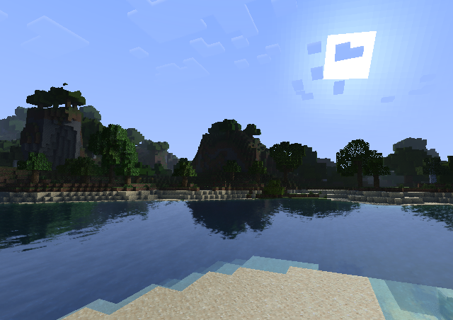
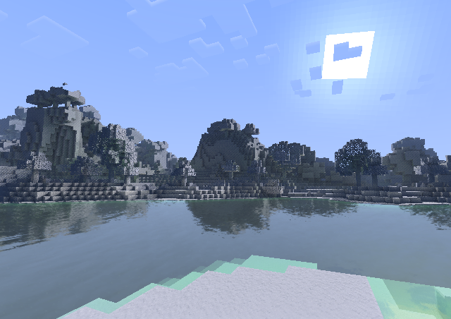

<h1 align = "center">lumina</h1>

<p align = "center">A peformance-oriented shader for Minecraft.</p>




## Installation

1. [](https://github.com/seilotte/lumina/archive/refs/heads/main.zip)
1. Place the downloaded ZIP file in your `.minecraft/shaderpacks` folder.

## Features

Explore the shader settings or refer to `lumina/shaders/lang/en_US.lang` for a comprehensive list of available features.

## Compatibility

This shader was developed using the following versions:

- Minecraft: 1.21.1
- [Fabric](https://fabricmc.net/): 0.16.3
- [Sodium](https://modrinth.com/mod/sodium): 0.6.0 (Beta 2) Fabric
- [Iris](https://modrinth.com/mod/iris): 1.8 (Beta 4) Fabric
- [Distant Horizons](https://modrinth.com/mod/distanthorizons): 2.2.1-a Fabric
- [SPBR](https://modrinth.com/resourcepack/spbr): 15.3

> *Note: Compatibility is limited to Iris.*

## Credits

Credits are included within the code using the following format:

```
// [Author(s)] link
// Title.
// Comment.
```
