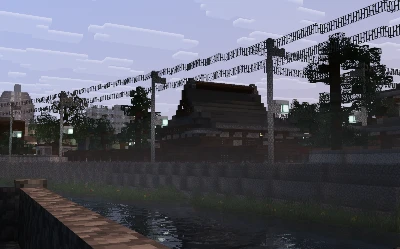
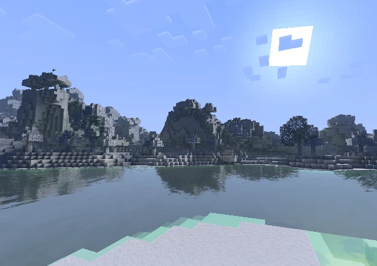

<h1 align = "center">
    lumina
</h1>

<p align = "center">
    A peformance-oriented shader for Minecraft.
</p>

<div align = "center">
<div style = "display:inline-block">
    
    
    <div style = "text-align:left">
        <em>
            Map:
            <a href="https://www.planetminecraft.com/project/matsuhama/">Matsuhama 松浜</a>
        </em>
    </div>
</div>
</div>

## Installation

1. Download [ZIP](https://github.com/seilotte/lumina/archive/refs/heads/main.zip).
1. Place the downloaded ZIP file in your `.minecraft/shaderpacks` folder.

## Features

Explore the shader settings or refer to [lumina/shaders/lang/en_GB.lang](./shaders/lang/en_GB.lang) for a comprehensive list of available features.

## Compatibility

This shader was developed using the following versions:

- Minecraft: 1.21.11
- [Fabric](https://fabricmc.net/): 0.18.4
- [Sodium](https://modrinth.com/mod/sodium): 0.8.2 Fabric
- [Iris](https://modrinth.com/mod/iris): 1.10.4 Fabric
- [Voxy](https://modrinth.com/mod/voxy): 0.2.9 (Alpha) Fabric
- [Photonics](https://modrinth.com/mod/photonics): 0.2.9 Fabric
- [SPBR](https://modrinth.com/resourcepack/spbr): 19.6

> [!NOTE]
> *Compatibility is limited to Iris and for systems that support OpenGL 4.6.*<br>
> *Voxy versions below 0.2.6-alpha are not supported.*

## Credits

Included within the code using the following format:

```
// [Author(s)] link
// Title.
// Comment.
```
